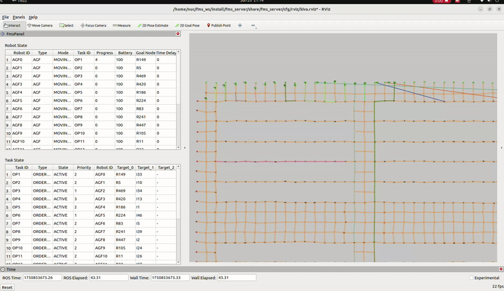
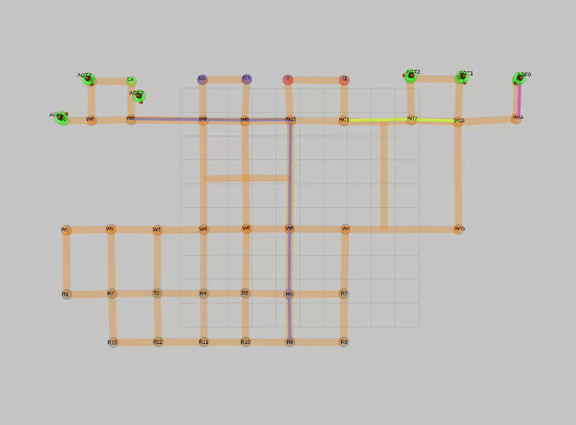
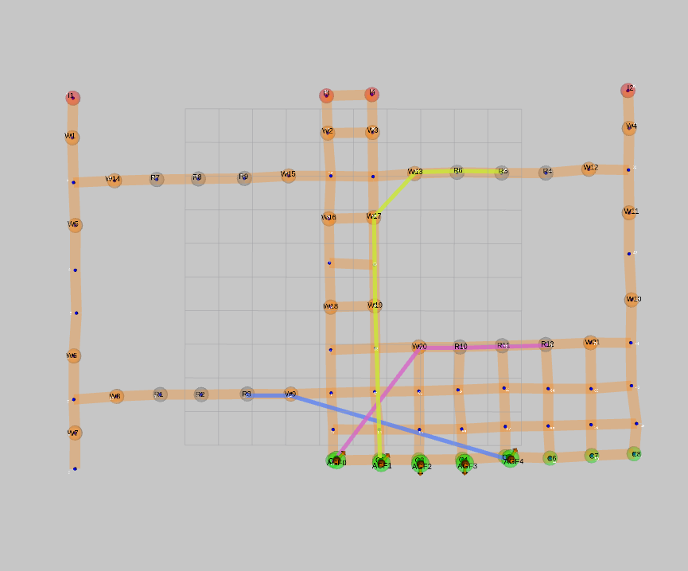
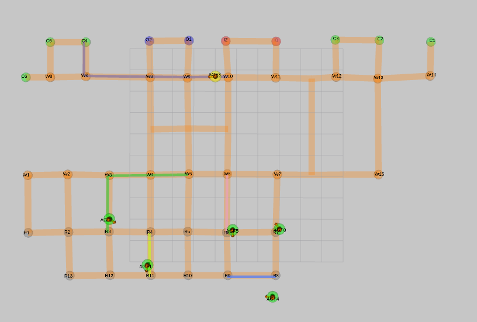

# Multi-Robot Fleet Management System for Logistics Automation

ROS 2 fleet orchestration stack for warehouse-style multi-robot pickup and delivery.

This repository packages the authored part of a semi-centralized fleet management system that handles online task assignment, collision-aware multi-robot routing, traffic control on lane graphs, operator-facing visualization, and robot-side execution. The goal is not a single planner demo, but a reviewable end-to-end system that connects scheduling, routing, simulation, and execution into one workflow.


A short Gazebo replay showing concurrent robot flow through shared warehouse lanes under the fleet manager's task allocation, routing, and traffic-control pipeline.

## Key Features

- TSP-based task group allocation that iteratively builds minimum-travel-distance task groups for multi-pickup delivery; an online TSP variant reorders only newly added targets, achieving ~1,900x faster computation than full TSP recomputation.
- Collision-aware routing on structured topological lane graphs instead of unrestricted free-grid motion.
- Route-table based traffic coordination between robots, the server, and the UI layer.
- End-to-end ROS 2 stack spanning fleet manager, RViz dashboard, simulation, and robot-side Nav2 integration.

## Evaluation Snapshot

Kiva warehouse and sorting center benchmarks (N = 100 agents, capacity C = 9). Reduction = (baseline - ours) / baseline, averaged across both maps.

| Comparison | Service Time | Makespan |
| --- | --- | --- |
| TSP-based task grouping vs. token-passing baseline (TP) | -78% | -62% |
| TSP-based task grouping vs. TP-TSP (strongest competing method) | -43% | -15% |
| Online TSP vs. full TSP recomputation (runtime only) | x1,900 faster | - |

## System Snapshot

| Layer | Main Packages | Purpose |
| --- | --- | --- |
| Core orchestration | `fms_core`, `fms_msgs`, `fms_server` | Task allocation, shared state, routing, launch flows, config assets |
| Operator view | `fms_panel`, `fms_route_viz` | RViz panel and route-table dependency visualization |
| Robot execution | `robot_manager`, `fms_robot`, `follow_poses`, `clear_costmap`, `fms_ctrl_board` | Route execution, Nav2 bridging, controller helpers, robot-side launch composition |
| Simulation | `fms_simulation`, `fms_gazebo`, `fms_custom_tb` | Scenario launch flows, simulation assets, custom testbed support |
| Navigation support | `ns_turtlebot3_navigation2` | Namespaced multi-robot Nav2 bringup for TurtleBot3-style platforms |

## Architecture


More detail: [Architecture Notes](docs/ARCHITECTURE.md)

## Demo Gallery

| Operator dashboard | Routing close-up |
| --- | --- |
|  |  |

| Warehouse lane close-up | Dense route overlay |
| --- | --- |
|  |  |

## Dependencies & Scope

This repository contains the authored fleet management components. Third-party dependencies are resolved separately via the pinned `.repos` manifests under `deps/` rather than vendored into the repository.

**Included:**
- Task allocation, routing, traffic control, and robot execution logic
- Launch configurations, topological maps, graph assets, task lists, and RViz configs
- Operator UI packages and demo media

**External dependencies** (imported via `vcs import` -- see [Quick Start](#quick-start)):

| Package | Notes |
| --- | --- |
| TurtleBot3 packages | Robot platform support (navigation, description, teleop) |
| Dynamixel SDK | Servo motor control for physical robots |
| AWS RoboMaker small warehouse world | Optional: large-scale warehouse scenario maps |
| Stage / `stage_ros2` | Optional: lightweight 2D simulation backend |

## Quick Start

### 1. Create a ROS 2 workspace

```bash
mkdir -p ~/fleet_ws/src
cd ~/fleet_ws/src
git clone https://github.com/YiBangWon/multi-robot-fleet-management-system.git
cd ..
```

### 2. Install the main dependencies

```bash
sudo apt update
sudo apt install -y \
  python3-vcstool \
  python3-rosdep \
  ros-humble-navigation2 \
  ros-humble-nav2-bringup \
  ros-humble-gazebo-ros-pkgs \
  ros-humble-rviz2 \
  python3-matplotlib \
  python3-networkx \
  libboost-all-dev \
  libyaml-cpp-dev \
  libeigen3-dev \
  libfltk1.3-dev
```

### 3. Import the external robot and simulator packages

The repository includes pinned `vcs` manifests for the validated dependency sets.

```bash
cd ~/fleet_ws
vcs import src < src/multi-robot-fleet-management-system/deps/ros2-humble-core.repos
```

Optional scenario packs:

```bash
cd ~/fleet_ws
vcs import src < src/multi-robot-fleet-management-system/deps/ros2-humble-aws-worlds.repos
vcs import src < src/multi-robot-fleet-management-system/deps/ros2-humble-stage.repos
```

Resolve ROS dependencies and build:

```bash
cd ~/fleet_ws
# Run `sudo rosdep init` once on a fresh machine if needed.
rosdep update
rosdep install --from-paths src --ignore-src -r -y
colcon build --symlink-install
source install/setup.bash
```

Optional Stage replay notes: [Setup Guide](docs/SETUP.md)

## Main Entry Points

### Gazebo multi-robot demo

```bash
ros2 launch fms_simulation fms_sim_gazebo.launch.py
```

Headless server smoke test:

```bash
ros2 launch fms_simulation fms_sim_gazebo.launch.py enable_gzclient:=false launch_rviz:=false
```

### Stage multi-robot demo

```bash
ros2 launch fms_simulation fms_sim_stage.launch.py
```

### Robot-side execution stack

```bash
ros2 launch fms_robot fms_robot.launch.py
```

### Route-table visualization

```bash
ros2 run fms_route_viz route_viz_node
```

## Repository Layout

```text
src/
  server/
    fms_core/                  Core fleet manager and planners
    fms_msgs/                  ROS 2 messages and services
    fms_panel/                 RViz operator panel
    fms_server/                Config assets and server-side launch files
  robot/
    robot_manager/             Route execution and robot controllers
    fms_robot/                 Robot-side composition launch files
    ns_turtlebot3_navigation2/ Multi-robot Nav2 bringup
  control_board/
    follow_poses/              Nav2 action bridge
    clear_costmap/             Costmap maintenance helper
    fms_ctrl_board/            Utility launch composition
  simulation/
    fms_simulation/            Demo launch flows and scenario configs
    fms_gazebo/                Gazebo assets and robot simulation support
  testbed/
    fms_custom_testbed/        Custom SSH-style testbed assets
  tools/
    fms_route_viz/             Route-table graph visualizer
docs/
  media/                       README images and GIFs
```

## Korean Overview

이 저장소는 물류 자동화를 위한 다중 로봇 fleet management system 구현과 실험 구성을 정리한 것입니다.

- 온라인으로 들어오는 작업을 TSP 기반 방식으로 묶고 로봇에 할당합니다.
- lane graph 기반으로 경로를 계획하고, route table로 충돌과 교착을 줄이도록 구성했습니다.
- 서버 측 FMS, RViz 대시보드, 시뮬레이션, 로봇 측 Nav2 실행 흐름까지 한 저장소에서 확인할 수 있습니다.
